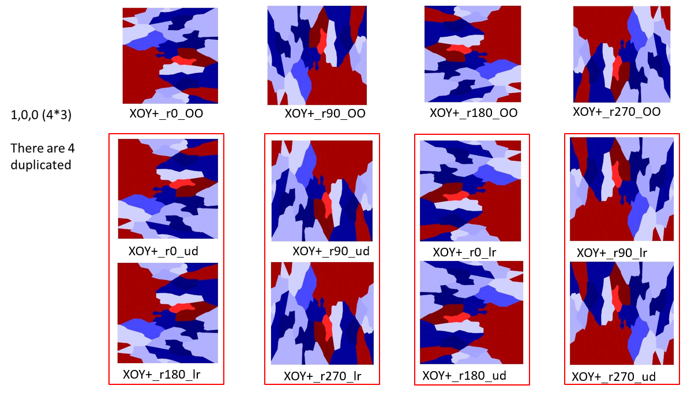

# Bionoi_Extend
The original version bionoi only has XOY principle direction projection.  

The extend version includes 6 projection directions, 4 rotation angles and 3 flip directions, 72 images in total.  

Projection direction:  

         XOY+, XOY-, YOZ+, YOZ-, ZOX+, ZOX-  (1,2,3,4,5,6)
	 0 means all directions will be included
	 
	
Rotate angle:  

          0, 90, 180, 270  (1,2,3,4)
	  0 means all directions will be included
	 
Flip  direction:  

          original, up-down, left-right  (1,2,3)
	  0 means all directions will be included
	  
  

## Examples  

	./voronoi.py
	or
	./voronoi.py -mol 4v94E.mol2 -out ./output/ -dpi 120 -alpha 0.5 -size 128 -proDirect 1 -rotAngle2D 0 -flip 0  
	

### As the result contains 4 duplicated images, we will change it to  6 * 4 * 2 = 48 images in next step.  
