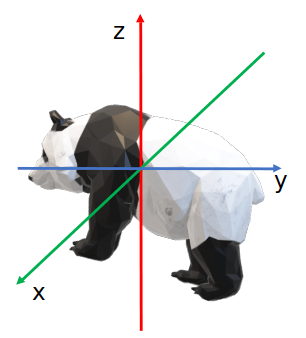
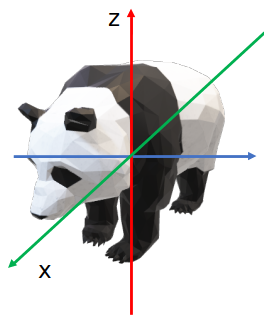
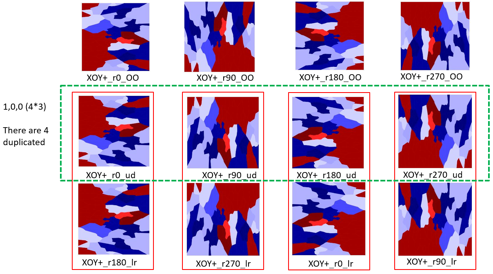
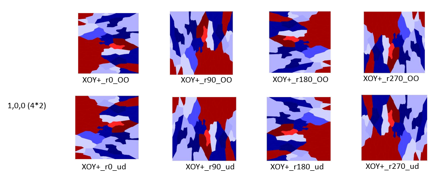

# Bionoi_Extend
The original version bionoi only has XOY principle direction projection.  

	Aligning the principal axes of 3D voxel data to XOY positive direction.   
	Then projecting the 3D voxel to 2D images.
&emsp;&emsp;&emsp;&emsp;&emsp;&emsp;&emsp;&emsp;&emsp;&emsp;&emsp;&emsp;   &emsp;&emsp;&emsp;&emsp;&emsp;&emsp;:arrow_right: &emsp;&emsp;&emsp;&emsp;&emsp;&emsp;    
	

The extend version includes 6 projection directions, 4 rotation angles and 3 flip directions, 72 images in total.  

Projection direction:  

	XOY+, XOY-, YOZ+, YOZ-, ZOX+, ZOX-  (1,2,3,4,5,6)
	0 means all directions will be included
	 
	
Rotate angle:  

	0, 90, 180, 270  (1,2,3,4)
	0 means all directions will be included
	 
Flip  direction:  

	original, up-down, left-right  (1,2,3)
	0 means all directions will be included
	  
  

## Examples  

	./main.py
	or
	./main.py -mol 4v94E.mol2 -out ./output/ -dpi 256 -alpha 0.9 -size 256 -proDirect 1 -rotAngle2D 0 -flip 0  
	

#### As the result contains 4 duplicated images, we will change it to  6 * 4 * 2 = 48 images in next step.  
Just shown in the picture above, only keep up-down flip direction.  

Flip  direction:  

	original, up-down  (1,2)
	0 means all directions will be included
## Examples  

	./main_48.py
	or
	./main_48.py -mol 4v94E.mol2 -out ./output/ -dpi 256 -alpha 0.9 -size 256 -proDirect 1 -rotAngle2D 0 -flip 0  
	

